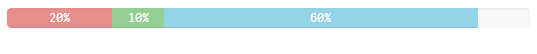

# sense-components

> Components to be used (in Widgets) in Qlik Sense.

## Components

- [sc-alert](#sc-alert)
- [sc-progressbar](#sc-progressbar)

_(TOC generated by [verb](https://github.com/verbose/verb) using [markdown-toc](https://github.com/jonschlinkert/markdown-toc))_

## sc-alert

> The official example to render a simple alert.

### Usage

```html
<sc-alert closable="true" auto-close-after="10">This is the alert message</sc-alert>
<sc-alert closable="true" design="warning">This is the alert message</sc-alert>
```

### Properties

* **`closable`** _{boolean}_ - Whether the alert should be closable or not. _(Default: false)_

* **`auto-close-after`** _{numeric}_ - Define the amount of milliseconds after which the alert should be automatically hidden.
* **`design`** _{string}_ - Defines the style of the component using Leonardo UI classes.
Possible values: `info`, `success`, `warning`, `danger`

### Screenshots


<!--## Minichart
-->

## sc-progressbar

> Progressbar component.

### Basic Example

**_Html:_**

```html
<sc-progressbar max="100" value="50">50%</sc-progressbar>
```

**_Result:_**


### Properties

* **`max`** _{number}_ - A number that specifies the total value of bars that is required. _(Default: 100)_

* **`value`**  _{number}_ - The current value of progress completed.
* **`type`** _{string}_ - Chosen design. Possible values are `primary`, `info`, `success`, `warning`, `danger`, `inverse` _(Default: null)_

* **`animate`** _{boolean}_ - Whether bars use transitions to achieve the width change. _(Default: true)_

#### Example Using All Properties

```html
<sc-progressbar 
    max="100" 
    value="50" 
    animate="true" 
    design="danger">50%
</sc-progressbar>
```

### Stacked Progressbar

If you want to add multiple bars into the same progressbar you can create a stacked progessbar:

**_Html:_**

```html
<sc-progressbar>
    <sc-progress>
        <sc-bar value="20" design="danger">20%</sc-bar>
        <sc-bar value="10" design="success">10%</sc-bar>
        <sc-bar value="60" design="info">60%</sc-bar>
    </sc-progress>
</sc-progressbar>
```

**_Result:_**

> 

### Design Types

Examples how a progressbar would look like depending on the chosen `design`:

> 

<!--false-->
<!--false-->

<!--

### [Alert component](src/sc-alert/sc-alert.js#L26)

Render an alert in different colors within Qlik Sense.

**Params**

* `closable` **{boolean}**: Whether the alert should be closable or not.
* `autoCloseAfter` **{number}**: If defined and greater than zero, the alert automatically hides after the value defined in milliseconds.
* `type` **{string}**: Chosen design. Possible values are `primary`, `info`, `success`, `warning`, `danger`, `inverse`. _(Default: null)_

-->