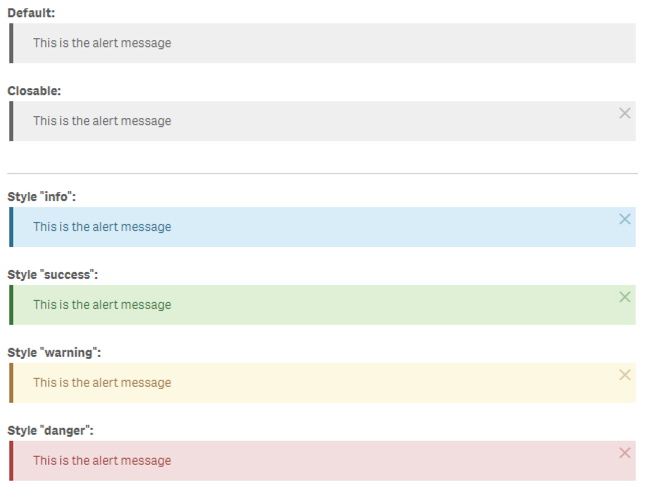

## Alert (`sc-alert`)

> Render a simple, customizable alert.

**Status:** Stable

### Usage

```html
<sc-alert closable="true" design="warning">This is the alert message</sc-alert>
<sc-alert closable="true" auto-close-after="500">This is the alert message, will be closed after 500ms</sc-alert>
```

### Properties

- **`closable`** *{boolean}* - Whether the alert should be closable or not. *(Default: false)*
- **`auto-close-after`** *{number}* - Define the amount of milliseconds after which the alert should be automatically hidden.
- **`type`** *{string}* - Defines the style of the component using Leonardo UI classes. 
Possible values: `default` `info`, `success`, `warning`, `danger`

### Screenshots


